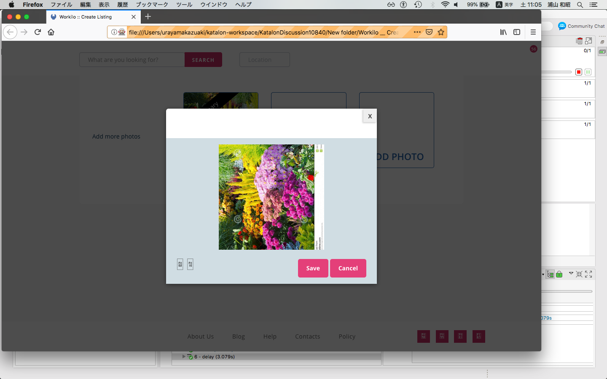

Reproducing a problem "Image rotation is not working"
=======

## What is this?

This is a small Katalon Studio project for demostration purpose.
You can download this and run with your Katalon Studio.

This project was developed using Katalon Studio ver5.8.6

In this project I tried to reproduce the problem raised in a Katalon Forum
discussion at https://forum.katalon.com/discussion/10840/image-rotation-is-not-working
The original question raised was:
>When i click on image rotation button in my application then its not working. All my test case is run successfully still rotating function is not working. then i change my xpath and used web recording features to find the xpath then in log its showing object is null. .

In the [thread](https://forum.katalon.com/discussion/10840/image-rotation-is-not-working), the originator shared a ZIP file which contained the target HTML and full set of surrounding resources(CSS,JS etc).

## Description

I made a Katalon Studio project which opens the locally saved HTML and do try clicking buttons to rotate the image.

I used Web Recorder tool to generate a few Test Objects.
- [Object Repository/Page_Workilo Create Listing](https://github.com/kazurayam/KatalonDiscussion10840/blob/master/Object%20Repository/Page_Workilo%20%20Create%20Listing/a_Rotate%20Image.rs)
- [Object Repository/Page_Workilo Create Listing/i_X_fa fa-rotate-left button](https://github.com/kazurayam/KatalonDiscussion10840/blob/master/Object%20Repository/Page_Workilo%20%20Create%20Listing/i_X_fa%20fa-rotate-left%20%20button_.rs)

Web Recorder generated a Test Case
- [TC1](https://github.com/kazurayam/KatalonDiscussion10840/blob/master/Scripts/TC1/Script1543022546931.groovy).

I modified this test case slightly to fix a problem: inserted a line:
```
WebUI.scrollToElement(findTestObject('Object Repository/Page_Workilo  Create Listing/a_Rotate Image'), 10)

```

When I ran the test case TC1, it succeeded without error. And I could see the image was rotated by WebUI.click().


## Conclusion

I could not reproduce the problem. The Web app and Katalon test case seem to be working OK.
